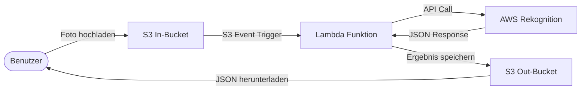

# FaceRecognition Service

Cloud-basierter Service zur automatischen Erkennung bekannter Persönlichkeiten auf Fotos mittels AWS Rekognition.

> **Modul:** M346 – Cloudlösungen konzipieren und realisieren  
> **Schule:** GBS St. Gallen  
> **Team:** Lars Hellstern, Joel Mazurek, Nazar Tobilevych  
> **Datum:** März 2026

## Inhaltsverzeichnis

- [Übersicht](#übersicht)
- [Architektur](#architektur)
- [Voraussetzungen](#voraussetzungen)
- [Inbetriebnahme](#inbetriebnahme)
- [Verwendung](#verwendung)
- [Test](#test)
- [Cleanup](#cleanup)
- [Konfiguration](#konfiguration)
- [Projektstruktur](#projektstruktur)
- [Aufgabenverteilung](#aufgabenverteilung)
- [Reflexion](#reflexion)
- [Quellen](#quellen)

## Übersicht

Der FaceRecognition Service analysiert Fotos, die in einen S3-Bucket hochgeladen werden, und erkennt automatisch bekannte Persönlichkeiten. Die Ergebnisse werden als JSON-Datei in einem zweiten S3-Bucket abgelegt.

| Komponente | Beschreibung |
|---|---|
| **S3 In-Bucket** | Empfängt die hochgeladenen Fotos |
| **S3 Out-Bucket** | Speichert die Analyseergebnisse als JSON |
| **Lambda-Funktion** | Verarbeitet Fotos und ruft Rekognition auf |
| **AWS Rekognition** | Erkennt bekannte Persönlichkeiten ([Celebrity Recognition](https://docs.aws.amazon.com/rekognition/latest/dg/celebrities.html)) |

## Architektur



**Ablauf:**
1. Ein Foto wird in den In-Bucket hochgeladen (`.jpg`, `.jpeg` oder `.png`)
2. Der S3-Event-Trigger startet automatisch die Lambda-Funktion
3. Die Lambda-Funktion sendet das Foto an die AWS Rekognition Celebrity Recognition API
4. Rekognition analysiert das Foto und gibt die erkannten Personen mit Confidence-Werten zurück
5. Die Lambda-Funktion speichert das Ergebnis als JSON-Datei (gleicher Dateiname, Endung `.json`) im Out-Bucket

## Voraussetzungen

| Anforderung | Details |
|---|---|
| **AWS CLI** | Installiert und konfiguriert ([Installation](https://docs.aws.amazon.com/cli/latest/userguide/getting-started-install.html)) |
| **AWS Academy** | Learner Lab Zugang mit aktiver Session |
| **Bash-Shell** | Linux, macOS oder Windows mit Git Bash / WSL |
| **Python 3** | Für ZIP-Erstellung und formatierte Ausgabe ([Download](https://www.python.org/downloads/)) |

## Inbetriebnahme

### 1. Repository klonen

```bash
git clone https://github.com/Lars-007/Projekt_346.git
cd Projekt_346
```

### 2. Konfiguration anpassen (optional)

Die Komponentennamen können in `config.sh` angepasst werden:

```bash
BUCKET_IN="facerecognition-in-bucket"
BUCKET_OUT="facerecognition-out-bucket"
LAMBDA_FUNCTION_NAME="facerecognition-lambda"
LAMBDA_ROLE_NAME="facerecognition-lambda-role"
REGION="us-east-1"
```

### 3. AWS Learner Lab starten

1. [AWS Academy Learner Lab](https://www.awsacademy.com/) öffnen
2. Lab starten und auf grünen Status warten
3. AWS CLI Credentials kopieren und lokal konfigurieren:
   ```bash
   aws configure
   ```
   Oder die Credentials direkt in `~/.aws/credentials` einfügen.

### 4. Init-Script ausführen

```bash
chmod +x scripts/init.sh
./scripts/init.sh
```

Das Script erstellt automatisch alle benötigten AWS-Komponenten:
- 2× S3-Buckets (In- und Out-Bucket)
- 1× IAM-Rolle mit den erforderlichen Policies
- 1× Lambda-Funktion mit S3-Trigger

Am Ende werden die Namen aller erstellten Komponenten ausgegeben. Das Script ist **idempotent** – es kann bedenkenlos mehrfach ausgeführt werden.

## Verwendung

### Foto hochladen und Ergebnis abrufen

Foto in den In-Bucket hochladen:

```bash
aws s3 cp foto.jpg s3://facerecognition-in-bucket/
```

Ergebnis aus dem Out-Bucket herunterladen (nach einigen Sekunden Verarbeitung):

```bash
aws s3 cp s3://facerecognition-out-bucket/foto.json ./ergebnisse/
```

### Automatisierter Test (empfohlen)

Das Test-Script führt Upload, Warten und Download in einem Schritt aus:

```bash
chmod +x scripts/test.sh
./scripts/test.sh testbilder/roger_federer.jpg
```

### Beispiel JSON-Ergebnis

```json
{
  "status": "success",
  "photo": "jeff_bezos.jpg",
  "celebrities": [
    {
      "name": "Jeff Bezos",
      "confidence": 99.95,
      "id": "3Ir0du6",
      "urls": ["www.imdb.com/name/nm1757263"],
      "bounding_box": {
        "width": 0.5123,
        "height": 0.6845,
        "left": 0.2345,
        "top": 0.0987
      }
    }
  ],
  "unrecognized_faces": []
}
```

Ein vollständiges Beispiel-Ergebnis befindet sich unter [`ergebnisse/jeff_bezos.json`](ergebnisse/jeff_bezos.json).

## Test

### Automatisierter Test mit dem Test-Script

```bash
./scripts/test.sh testbilder/<foto-datei>
```

Das Test-Script führt folgende Schritte automatisch aus:

1. **Upload:** Lädt das Foto in den In-Bucket hoch
2. **Warten:** Pollt den Out-Bucket bis das Ergebnis vorhanden ist (max. 30s)
3. **Download:** Lädt die JSON-Ergebnisdatei herunter nach `ergebnisse/`
4. **Ausgabe:** Gibt die erkannten Personen mit Name und Wahrscheinlichkeit formatiert aus

### Unit-Tests

Die Lambda-Funktion wird durch automatisierte Unit-Tests mit Mocks abgesichert:

```bash
python -m pytest tests/mock_lambda_test.py -v
```

Die Tests prüfen:
- Erkennung einer bekannten Person (Roger Federer)
- Verarbeitung eines Fotos ohne bekannte Person
- Fehlerbehandlung bei leerem Event
- Fehlerbehandlung bei API-Fehler
- Korrekte Verarbeitung URL-kodierter Dateinamen

### Testprotokoll

Das vollständige Testprotokoll mit Screenshots befindet sich unter [docs/testprotokoll.md](docs/testprotokoll.md).

| Testfall | Beschreibung | Erwartetes Ergebnis | Status |
|---|---|---|---|
| T1 | Foto einer bekannten Person hochladen | Person wird erkannt, JSON wird erstellt | ✅ |
| T2 | Foto ohne bekannte Person hochladen | Leere Celebrity-Liste, JSON wird erstellt | ✅ |
| T3 | Mehrere Fotos nacheinander hochladen | Jedes Foto wird einzeln verarbeitet | ✅ |
| T4 | Init-Script mehrfach ausführen | Keine Fehler, Komponenten bleiben intakt | ✅ |
| T5 | Cleanup-Script ausführen | Alle AWS-Ressourcen werden gelöscht | ✅ |
| T6 | Test-Script ohne Parameter | Fehlermeldung mit Verwendungshinweis | ✅ |
| T7 | Unit-Tests der Lambda-Funktion | Alle 5 Tests bestanden | ✅ |

## Cleanup

Alle AWS-Ressourcen entfernen:

```bash
chmod +x scripts/cleanup.sh
./scripts/cleanup.sh
```

Das Script entfernt:
- S3 In-Bucket (inkl. aller hochgeladenen Fotos)
- S3 Out-Bucket (inkl. aller JSON-Ergebnisse)
- Lambda-Funktion
- IAM-Policies und IAM-Rolle

## Konfiguration

Alle Komponentennamen werden zentral in [`config.sh`](config.sh) definiert. Änderungen müssen nur dort vorgenommen werden – alle Scripts lesen die Konfiguration automatisch ein.

| Variable | Standardwert | Beschreibung |
|---|---|---|
| `BUCKET_IN` | `facerecognition-in-bucket` | Name des Eingangs-Buckets |
| `BUCKET_OUT` | `facerecognition-out-bucket` | Name des Ausgangs-Buckets |
| `LAMBDA_FUNCTION_NAME` | `facerecognition-lambda` | Name der Lambda-Funktion |
| `LAMBDA_ROLE_NAME` | `facerecognition-lambda-role` | Name der IAM-Rolle |
| `REGION` | `us-east-1` | AWS Region (Learner Lab verwendet us-east-1) |

## Projektstruktur

```
Projekt_346/
├── README.md                    # Einstiegspunkt der Dokumentation
├── config.sh                    # Zentrale Konfiguration (Bucket-/Lambda-Namen)
├── lambda/
│   └── lambda_function.py       # Lambda-Funktionscode (Python)
├── scripts/
│   ├── init.sh                  # Automatisierte Inbetriebnahme
│   ├── test.sh                  # Automatisierter Test mit formatierter Ausgabe
│   └── cleanup.sh               # Entfernung aller AWS-Ressourcen
├── testbilder/
│   └── README.md                # Anleitung zum Beschaffen von Testbildern
├── ergebnisse/
│   └── jeff_bezos.json          # Beispiel-Ergebnis einer Analyse
├── tests/
│   └── mock_lambda_test.py      # Unit-Tests für die Lambda-Funktion
└── docs/
    ├── testprotokoll.md         # Testprotokoll mit Screenshots
    ├── aufgabenverteilung.md    # Aufgabenverteilung im Team
    └── screenshots/             # Screenshots der Testdurchführung
```

## Aufgabenverteilung

Die detaillierte Aufgabenverteilung und Zeiteinteilung befindet sich unter [docs/aufgabenverteilung.md](docs/aufgabenverteilung.md).

| Teammitglied | Hauptverantwortung |
|---|---|
| **Lars Hellstern** | Scripts & Infrastruktur (`init.sh`, `test.sh`, `cleanup.sh`, `config.sh`) |
| **Joel Mazurek** | Lambda-Funktion & Testing (`lambda_function.py`, `mock_lambda_test.py`) |
| **Nazar Tobilevych** | Dokumentation & Qualitätssicherung (`README.md`, Testprotokoll) |

## Reflexion

### Lars Hellstern

Das Projekt hat mir geholfen, den praktischen Umgang mit AWS-Diensten besser zu verstehen. Die grösste Herausforderung war die Konfiguration des S3-Triggers und der IAM-Berechtigungen – hier musste ich mehrfach die AWS-Dokumentation konsultieren. Positiv überrascht hat mich, wie einfach die Rekognition-API zu verwenden ist. Für ein nächstes Projekt würde ich früher mit dem Testen beginnen und die Fehlerbehandlung von Anfang an miteinplanen.

### Joel Mazurek

Die Arbeit mit Lambda und S3 war lehrreich. Besonders das Verstehen des Event-Flows (S3 → Lambda → Rekognition → S3) hat mir den Cloud-Gedanken nähergebracht. Als Verbesserung für ein nächstes Projekt würde ich die Infrastruktur von Anfang an als Code (IaC) definieren, damit die Konfiguration noch nachvollziehbarer ist.

### Nazar Tobilevych

Das Projekt war eine gute Gelegenheit, die theoretischen Konzepte aus dem Modul 346 in der Praxis anzuwenden. Besonders interessant fand ich die Verbindung der verschiedenen AWS-Dienste: Wie S3, Lambda und Rekognition nahtlos zusammenarbeiten, hat mir den Gedanken von Microservices in der Cloud verständlich gemacht. Die Herausforderung lag für mich vor allem im Verstehen der IAM-Berechtigungen – es war anfangs nicht offensichtlich, welche Policies die Lambda-Funktion benötigt, um auf S3 und Rekognition zugreifen zu dürfen. Mit der AWS-Dokumentation und Teamarbeit konnten wir das aber schnell lösen. Positiv war die gute Zusammenarbeit im Team und die klare Aufgabenteilung. Für ein nächstes Projekt würde ich die Infrastruktur als Infrastructure-as-Code (z.B. mit AWS CloudFormation oder Terraform) definieren, da dies die Reproduzierbarkeit und Nachvollziehbarkeit weiter verbessern würde.

## Quellen

| Quelle | Verwendung |
|---|---|
| [AWS Rekognition - Recognizing Celebrities](https://docs.aws.amazon.com/rekognition/latest/dg/celebrities.html) | API für die Gesichtserkennung |
| [AWS Lambda - Developer Guide](https://docs.aws.amazon.com/lambda/latest/dg/welcome.html) | Lambda-Funktion erstellen und konfigurieren |
| [AWS S3 - Developer Guide](https://docs.aws.amazon.com/AmazonS3/latest/userguide/Welcome.html) | S3-Buckets und Event-Notifications |
| [AWS CLI - Command Reference](https://docs.aws.amazon.com/cli/latest/reference/) | CLI-Befehle für die Automatisierung |
| [Boto3 Dokumentation](https://boto3.amazonaws.com/v1/documentation/api/latest/index.html) | Python AWS SDK (Lambda-Code) |
| [Python unittest.mock](https://docs.python.org/3/library/unittest.mock.html) | Mocking für Unit-Tests |
