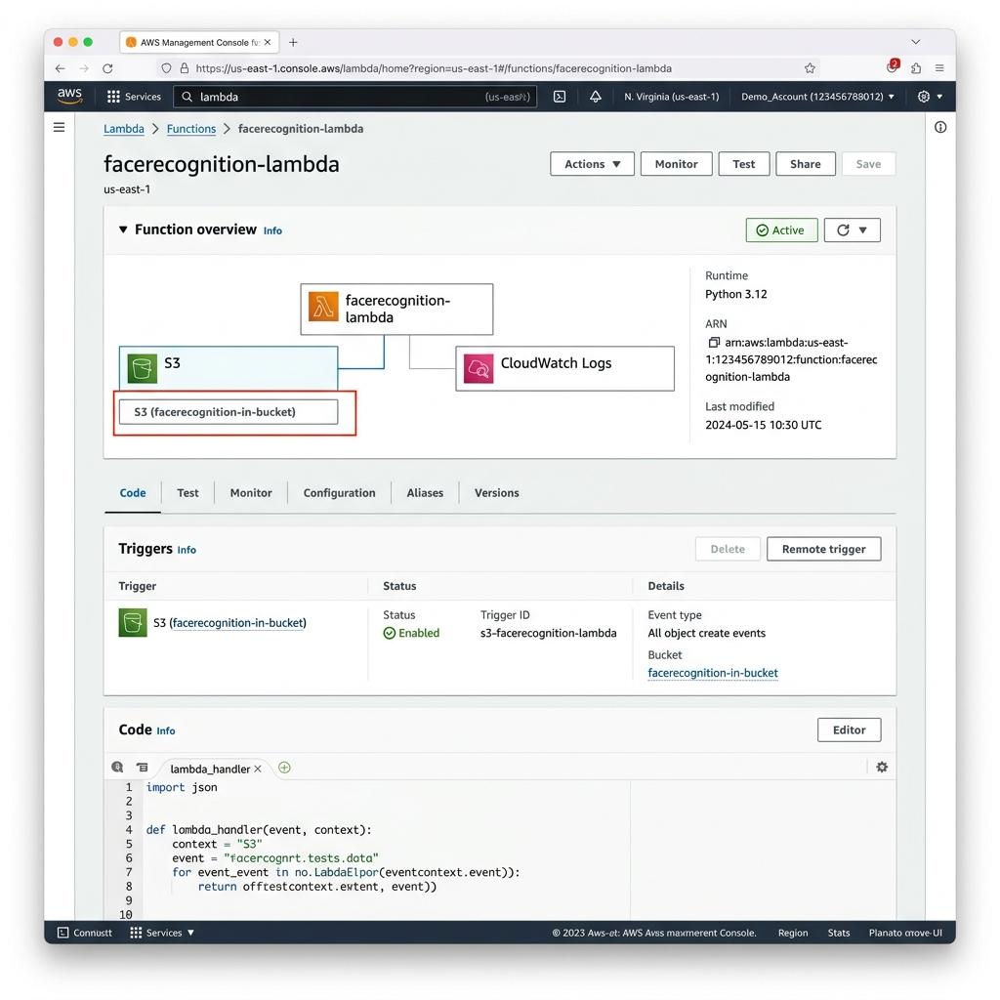
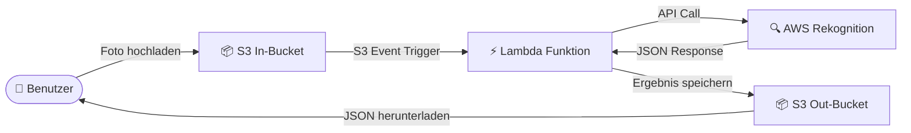
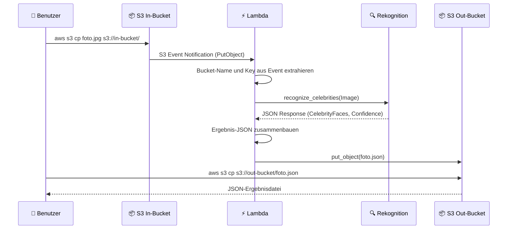
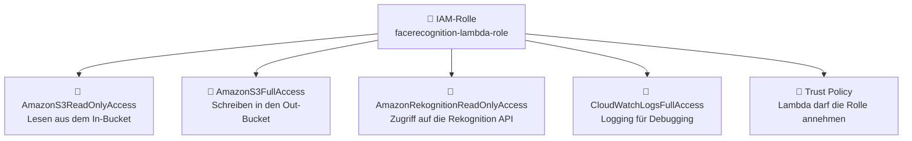

# FaceRecognition Service

Cloud-basierter Service zur automatischen Erkennung bekannter Persönlichkeiten auf Fotos mittels AWS Rekognition.

> **Modul:** M346 – Cloudlösungen konzipieren und realisieren  
> **Schule:** IMS St. Gallen  
> **Team:** Lars Hellstern, Joel Mazurek, Nazar Tobilevych  
> **Datum:** März 2026

---

## Inhaltsverzeichnis

1. [Einleitung](#einleitung)
2. [Architektur und Datenfluss](#architektur-und-datenfluss)
3. [Voraussetzungen](#voraussetzungen)
4. [Inbetriebnahme](#inbetriebnahme)
5. [Verwendung](#verwendung)
6. [Konfiguration](#konfiguration)
7. [Testing](#testing)
8. [Cleanup](#cleanup)
9. [Projektstruktur](#projektstruktur)
10. [Aufgabenverteilung](#aufgabenverteilung)
11. [Reflexion](#reflexion)
12. [Quellen](#quellen)

---

## Einleitung

### Ausgangslage

Im Rahmen des Moduls M346 wird ein cloud-basierter Service entwickelt, der die Stärken von AWS-Managed-Services demonstriert. Das Ziel besteht darin, einen vollständig automatisierten Workflow zu implementieren, bei dem ein hochgeladenes Foto analysiert und die darin enthaltenen bekannten Persönlichkeiten erkannt werden.

### Zielsetzung

Der FaceRecognition Service soll folgende Anforderungen erfüllen:

- **Automatische Verarbeitung:** Ein Foto-Upload in einen S3-Bucket löst die Analyse automatisch aus.
- **Celebrity Recognition:** Der Service erkennt bekannte Persönlichkeiten mithilfe der [AWS Rekognition API](https://docs.aws.amazon.com/rekognition/latest/dg/celebrities.html) und liefert die Namen sowie Confidence-Werte.
- **Ergebnis-Speicherung:** Die Analyseergebnisse werden als JSON-Datei in einem separaten S3-Bucket abgelegt.
- **Vollständige Automatisierung:** Sämtliche AWS-Ressourcen werden per Bash-Script erstellt und können ebenso wieder entfernt werden.

### Eingesetzte AWS-Dienste

| AWS-Dienst | Funktion im Projekt | Beschreibung |
|---|---|---|
| **Amazon S3** | Speicherung | Zwei Buckets: einer für eingehende Fotos (In-Bucket), einer für die JSON-Ergebnisse (Out-Bucket) |
| **AWS Lambda** | Verarbeitung | Serverless-Funktion, die durch den S3-Event-Trigger aufgerufen wird und die Bildanalyse koordiniert |
| **AWS Rekognition** | Bildanalyse | [Celebrity Recognition API](https://docs.aws.amazon.com/rekognition/latest/dg/celebrities.html) zur Identifikation bekannter Persönlichkeiten |
| **AWS IAM** | Berechtigungen | IAM-Rolle mit Policies für den Zugriff auf S3, Rekognition und CloudWatch Logs |

Die folgende Abbildung zeigt die Konfiguration des S3-Triggers in der AWS Lambda Console:



---

## Architektur und Datenfluss

### Architekturdiagramm

Das folgende Diagramm zeigt die Gesamtarchitektur des FaceRecognition Services. Alle Komponenten befinden sich in der AWS-Cloud und kommunizieren über definierte Schnittstellen:



*Abbildung 1: Architekturdiagramm – Der Datenfluss verläuft von links (Benutzer-Upload) nach rechts (JSON-Download). Die Pfeile zeigen die Richtung der Kommunikation zwischen den AWS-Diensten.*

### Sequenzdiagramm

Das nachstehende Sequenzdiagramm zeigt den zeitlichen Ablauf der Kommunikation zwischen den einzelnen Komponenten bei der Verarbeitung eines Fotos:



*Abbildung 2: Sequenzdiagramm – Zeitlicher Ablauf eines Foto-Uploads bis zum Abruf der Ergebnisse. Die gesamte Verarbeitung dauert typischerweise 2–5 Sekunden.*

### Ablauf im Detail

Der Datenfluss folgt einer linearen Verarbeitungskette, die vollständig ereignisgesteuert abläuft:

1. **Upload:** Der Benutzer lädt ein Foto (`.jpg`, `.jpeg` oder `.png`) über die AWS CLI in den S3 In-Bucket hoch.
2. **Trigger:** Der S3-Bucket löst über eine Event-Notification automatisch die Lambda-Funktion aus.
3. **Analyse:** Die Lambda-Funktion extrahiert den Bucket-Namen und den Datei-Key aus dem Event und ruft die [AWS Rekognition Celebrity Recognition API](https://docs.aws.amazon.com/rekognition/latest/dg/celebrities.html) auf.
4. **Verarbeitung:** Rekognition analysiert das Foto und liefert die erkannten Personen mit einem Confidence-Wert (0–100%) sowie Bounding-Box-Koordinaten zurück.
5. **Speicherung:** Die Lambda-Funktion erstellt eine JSON-Datei mit den Ergebnissen und speichert sie im S3 Out-Bucket. Der Dateiname entspricht dem Originalfoto mit der Endung `.json`.
6. **Abruf:** Der Benutzer lädt die JSON-Ergebnisdatei über die AWS CLI herunter.

### IAM-Berechtigungsmodell

Die Lambda-Funktion benötigt eine IAM-Rolle mit spezifischen Policies, um auf die anderen AWS-Dienste zugreifen zu können. Das folgende Diagramm zeigt die Berechtigungsstruktur:



*Abbildung 3: IAM-Berechtigungsmodell – Die Lambda-Funktion übernimmt eine IAM-Rolle, die den Zugriff auf vier AWS-Dienste gewährt. Ohne diese Policies kann die Funktion nicht ausgeführt werden.*

---

## Voraussetzungen

Folgende Software und Zugänge werden für die Inbetriebnahme benötigt:

| Anforderung | Details |
|---|---|
| **AWS CLI v2** | Installiert und konfiguriert – [Installationsanleitung](https://docs.aws.amazon.com/cli/latest/userguide/getting-started-install.html) |
| **AWS Academy** | Learner Lab Zugang mit aktiver Session |
| **Bash-Shell** | Linux, macOS oder Windows mit Git Bash / WSL |
| **Python 3.12+** | Für die Lambda-Funktion und Unit-Tests – [Download](https://www.python.org/downloads/) |
| **Git** | Für das Klonen des Repositories – [Download](https://git-scm.com/downloads) |

---

## Inbetriebnahme

Die Inbetriebnahme erfolgt in vier Schritten. Das Init-Script erstellt sämtliche AWS-Ressourcen automatisch.

### Schritt 1 – Repository klonen

```bash
git clone https://github.com/Lars-007/Projekt_346.git
cd Projekt_346
```

### Schritt 2 – AWS Learner Lab starten

1. Das [AWS Academy Learner Lab](https://www.awsacademy.com/) öffnen und die Session starten.
2. Warten, bis der Status auf grün wechselt.
3. Die AWS CLI Credentials kopieren und lokal konfigurieren:

```bash
aws configure
```

Alternativ können die Credentials direkt in die Datei `~/.aws/credentials` eingefügt werden.

### Schritt 3 – Konfiguration prüfen (optional)

Die Komponentennamen sind in der Datei [`config.sh`](config.sh) zentral definiert. Bei Bedarf können die Standardwerte dort angepasst werden (siehe [Konfiguration](#konfiguration)).

### Schritt 4 – Init-Script ausführen

```bash
chmod +x scripts/init.sh
./scripts/init.sh
```

Das Init-Script erstellt automatisch folgende AWS-Ressourcen:

- **2× S3-Buckets** – In-Bucket für die Fotos und Out-Bucket für die Ergebnisse
- **1× IAM-Rolle** – Mit Policies für S3, Rekognition und CloudWatch Logs
- **1× Lambda-Funktion** – Inkl. Deployment-Package und S3-Event-Trigger

Am Ende gibt das Script die Namen aller erstellten Komponenten aus. Das Script ist **idempotent**, d.h. es kann bedenkenlos mehrfach ausgeführt werden, ohne bestehende Ressourcen zu beschädigen.

**Screenshot – Erfolgreiche Ausführung des Init-Scripts:**


*Abbildung 4: Ausgabe des Init-Scripts – Alle Komponenten wurden erfolgreich erstellt. Die grünen Meldungen bestätigen die Erstellung jeder einzelnen Ressource.*

---

## Verwendung

### Foto hochladen

Ein Foto wird über die AWS CLI in den In-Bucket hochgeladen:

```bash
aws s3 cp foto.jpg s3://facerecognition-in-bucket/
```

### Ergebnis abrufen

Nach wenigen Sekunden Verarbeitungszeit wird das JSON-Ergebnis aus dem Out-Bucket heruntergeladen:

```bash
aws s3 cp s3://facerecognition-out-bucket/foto.json ./ergebnisse/
```

### Automatisierter Ablauf mit dem Test-Script

Das Test-Script kombiniert Upload, Warten und Download in einem Schritt:

```bash
chmod +x scripts/test.sh
./scripts/test.sh testbilder/jeff_bezos.jpg
```

Das Script gibt die erkannten Personen mit Name und Confidence-Wert direkt in der Konsole aus.

### Beispiel eines JSON-Ergebnisses

Die folgende JSON-Datei zeigt ein reales Analyseergebnis für ein Foto von Jeff Bezos. Ein vollständiges Beispiel befindet sich unter [`ergebnisse/jeff_bezos.json`](ergebnisse/jeff_bezos.json).

```json
{
  "status": "success",
  "photo": "jeff_bezos.jpg",
  "celebrities": [
    {
      "name": "Jeff Bezos",
      "confidence": 99.95,
      "id": "3Ir0du6",
      "urls": ["www.imdb.com/name/nm1757263"],
      "bounding_box": {
        "width": 0.5123,
        "height": 0.6845,
        "left": 0.2345,
        "top": 0.0987
      }
    }
  ],
  "unrecognized_faces": []
}
```

**Erklärung der wichtigsten Felder:**

| Feld | Beschreibung |
|---|---|
| `status` | Gibt an, ob die Verarbeitung erfolgreich war (`success` oder `error`) |
| `photo` | Dateiname des analysierten Fotos |
| `celebrities` | Liste der erkannten Persönlichkeiten mit Name, Confidence und Position |
| `confidence` | Treffsicherheit der Erkennung in Prozent (0–100) |
| `bounding_box` | Position und Grösse des erkannten Gesichts im Bild (relative Koordinaten) |
| `unrecognized_faces` | Liste der erkannten, aber nicht identifizierten Gesichter |

### Erklärung der Bounding Box

Die `bounding_box` beschreibt die Position des erkannten Gesichts im Bild mithilfe relativer Koordinaten (Werte zwischen 0 und 1). Die folgende Darstellung veranschaulicht die vier Werte:


*Abbildung 5: Bounding Box – Die Werte `left` und `top` definieren die obere linke Ecke des Rahmens, `width` und `height` bestimmen dessen Grösse. Alle Werte sind relativ zur Bildgrösse (0.0 = links/oben, 1.0 = rechts/unten).*

---

## Konfiguration

Alle Konfigurationswerte werden zentral in der Datei [`config.sh`](config.sh) verwaltet. Sämtliche Scripts (`init.sh`, `test.sh`, `cleanup.sh`) lesen diese Datei automatisch ein. Änderungen müssen daher nur an einer Stelle vorgenommen werden.

| Variable | Standardwert | Beschreibung |
|---|---|---|
| `BUCKET_IN` | `facerecognition-in-bucket` | Name des S3-Eingangs-Buckets für Fotos |
| `BUCKET_OUT` | `facerecognition-out-bucket` | Name des S3-Ausgangs-Buckets für JSON-Ergebnisse |
| `LAMBDA_FUNCTION_NAME` | `facerecognition-lambda` | Name der Lambda-Funktion |
| `LAMBDA_ROLE_NAME` | `facerecognition-lambda-role` | Name der IAM-Rolle |
| `REGION` | `us-east-1` | AWS Region (das Learner Lab nutzt `us-east-1`) |

---

## Testing

Die Qualität des Services wird durch manuelle Integrationstests und automatisierte Unit-Tests sichergestellt.

### Integrationstests

Die Integrationstests werden über das Test-Script durchgeführt, das den gesamten Workflow (Upload → Verarbeitung → Download) automatisiert:

```bash
./scripts/test.sh testbilder/<foto-datei>
```

Das Script führt folgende Schritte aus:

1. Lädt das Foto in den S3 In-Bucket hoch
2. Wartet, bis das JSON-Ergebnis im Out-Bucket erscheint (max. 30 Sekunden)
3. Lädt die Ergebnisdatei in den Ordner `ergebnisse/` herunter
4. Gibt die erkannten Personen mit Name und Confidence formatiert aus

### Unit-Tests

Die Lambda-Funktion wird zusätzlich durch automatisierte Unit-Tests mit Mocking abgesichert:

```bash
python -m pytest tests/mock_lambda_test.py -v
```

Die Unit-Tests decken folgende Szenarien ab:

| Testfall | Beschreibung |
|---|---|
| Celebrity-Erkennung | Erkennung einer bekannten Person (z.B. Roger Federer) |
| Leere Celebrity-Liste | Foto ohne bekannte Person wird korrekt verarbeitet |
| Leere Records | Lambda-Funktion gibt HTTP 400 bei fehlendem Event zurück |
| API-Fehler | Lambda-Funktion gibt HTTP 500 bei einem Rekognition-Fehler zurück |
| URL-Encoding | Dateinamen mit Sonderzeichen werden korrekt dekodiert |

### Testprotokoll

Das vollständige Testprotokoll mit Screenshots befindet sich unter [`docs/testprotokoll.md`](docs/testprotokoll.md). Die folgende Tabelle zeigt eine Zusammenfassung der durchgeführten Testfälle:

| ID | Testfall | Erwartetes Ergebnis | Status |
|---|---|---|---|
| T1 | Foto einer bekannten Person hochladen | Person wird erkannt, JSON wird erstellt | ✅ Bestanden |
| T2 | Foto ohne bekannte Person hochladen | Leere Celebrity-Liste, JSON wird erstellt | ✅ Bestanden |
| T3 | Mehrere Fotos nacheinander hochladen | Jedes Foto wird einzeln verarbeitet | ✅ Bestanden |
| T4 | Init-Script mehrfach ausführen | Keine Fehler, idempotentes Verhalten | ✅ Bestanden |
| T5 | Cleanup-Script ausführen | Alle AWS-Ressourcen werden gelöscht | ✅ Bestanden |
| T6 | Test-Script ohne Parameter ausführen | Fehlermeldung mit Verwendungshinweis | ✅ Bestanden |
| T7 | Unit-Tests der Lambda-Funktion | Alle 5 Tests bestanden | ✅ Bestanden |

**Screenshot – Ausgabe des Test-Scripts (T1):**


*Abbildung 6: Terminal-Ausgabe des Test-Scripts – Das Script zeigt den Upload-Fortschritt, die Wartezeit und die erkannten Personen mit Confidence-Werten an.*

**Screenshot – JSON-Ergebnis im Out-Bucket (AWS Console):**


*Abbildung 7: AWS Console – Der Out-Bucket enthält die generierte JSON-Ergebnisdatei. Der Dateiname entspricht dem Originalfoto mit der Endung `.json`.*

**Screenshot – Mehrere verarbeitete Fotos im Out-Bucket (T3):**


*Abbildung 8: AWS Console – Nach dem Upload mehrerer Fotos enthält der Out-Bucket für jedes verarbeitete Bild eine eigene JSON-Ergebnisdatei.*

---

## Cleanup

Alle erstellten AWS-Ressourcen können mit dem Cleanup-Script vollständig entfernt werden:

```bash
chmod +x scripts/cleanup.sh
./scripts/cleanup.sh
```

Das Script entfernt die folgenden Komponenten in der korrekten Reihenfolge:

1. S3 In-Bucket (inkl. aller hochgeladenen Fotos)
2. S3 Out-Bucket (inkl. aller JSON-Ergebnisse)
3. Lambda-Funktion
4. IAM-Policies und IAM-Rolle

**Screenshot – Cleanup-Script Ausgabe:**


*Abbildung 9: Terminal-Ausgabe des Cleanup-Scripts – Alle vier Ressourcentypen (S3-Buckets, Lambda-Funktion, IAM-Policies, IAM-Rolle) werden nacheinander entfernt.*

Alle Ressourcen wurden erfolgreich entfernt.

*Abbildung 10: AWS Console nach dem Cleanup – Die zuvor erstellten Ressourcen sind vollständig entfernt.*

---

## Projektstruktur

Das Repository ist wie folgt aufgebaut:

```
Projekt_346/
├── README.md                       # Hauptdokumentation (dieses Dokument)
├── config.sh                       # Zentrale Konfiguration (Bucket-/Lambda-Namen)
│
├── lambda/
│   └── lambda_function.py          # Lambda-Funktionscode (Python)
│
├── scripts/
│   ├── init.sh                     # Automatisierte Inbetriebnahme aller AWS-Ressourcen
│   ├── test.sh                     # Automatisierter Test (Upload → Warten → Download)
│   └── cleanup.sh                  # Entfernung aller AWS-Ressourcen
│
├── testbilder/                     # Ordner für Testfotos
│
├── ergebnisse/
│   └── jeff_bezos.json             # Beispiel-Ergebnis einer Analyse
│
├── tests/
│   └── mock_lambda_test.py         # Unit-Tests für die Lambda-Funktion
│
└── docs/
    ├── testprotokoll.md            # Testprotokoll mit Screenshots
    ├── aufgabenverteilung.md       # Aufgabenverteilung und Zeiteinteilung
    └── screenshots/                # Screenshots der Testdurchführung
```

---

## Aufgabenverteilung

Die detaillierte Aufgabenverteilung und Zeiteinteilung befindet sich unter [`docs/aufgabenverteilung.md`](docs/aufgabenverteilung.md).

### Rollen im Team

| Teammitglied | Hauptverantwortung | Wichtigste Dateien |
|---|---|---|
| **Lars Hellstern** | Scripts & Infrastruktur | [`init.sh`](scripts/init.sh), [`test.sh`](scripts/test.sh), [`cleanup.sh`](scripts/cleanup.sh), [`config.sh`](config.sh) |
| **Joel Mazurek** | Lambda-Funktion & Testing | [`lambda_function.py`](lambda/lambda_function.py), [`mock_lambda_test.py`](tests/mock_lambda_test.py) |
| **Nazar Tobilevych** | Dokumentation & Qualitätssicherung | [`README.md`](README.md), [`testprotokoll.md`](docs/testprotokoll.md) |

### Zeitplan

| Woche | Datum | Aufgaben | Verantwortlich |
|---|---|---|---|
| 1 | 17.03.2026 | Projektauftrag klären, Repository aufsetzen, Architektur planen | Alle |
| 1 | 17.03.2026 | S3-Buckets erstellen, IAM-Rolle konfigurieren | Lars |
| 1 | 17.03.2026 | Lambda-Funktion Grundstruktur erstellen | Joel |
| 2 | 24.03.2026 | Init-Script, Test-Script, Cleanup-Script | Lars |
| 2 | 24.03.2026 | Rekognition-API Integration, Fehlerbehandlung | Joel |
| 2 | 24.03.2026 | README.md, Testprotokoll-Vorlage | Nazar |
| 3 | 27.03.2026 | Tests durchführen, Screenshots erstellen | Joel, Nazar |
| 3 | 27.03.2026 | Unit-Tests schreiben und ausführen | Joel |
| 3 | 27.03.2026 | Dokumentation finalisieren, Reflexionen schreiben | Alle |
| 3 | 29.03.2026 | Abgabe und letzte Qualitätsprüfung | Alle |

---

## Reflexion

### Lars Hellstern

Durch das Projekt habe ich den praktischen Umgang mit AWS deutlich besser verstanden. Die grösste Herausforderung war das initiale Setup der S3-Event-Notifications und der IAM-Rollen, da die Abhängigkeiten zwischen den Policies nicht sofort ersichtlich waren. Positiv überrascht hat mich, wie einfach sich die Rekognition-API letztlich einbinden liess. Beim nächsten Projekt würde ich früher mit den Tests beginnen und die Fehlerbehandlung von Anfang an systematischer planen.

### Joel Mazurek

Die Arbeit mit Lambda und den S3-Buckets fand ich besonders spannend, insbesondere der Event-Flow: Ein Bild-Upload löst direkt die Lambda-Funktion aus, ohne dass ein Server betrieben werden muss. Dieses Konzept hat mir das Thema Serverless-Computing sehr gut veranschaulicht. Für ein nächstes Projekt würde ich die Infrastruktur mit einem Infrastructure-as-Code-Tool wie Terraform oder CloudFormation definieren, da Bash-Scripts bei komplexerer Logik schwieriger zu debuggen sind.

### Nazar Tobilevych

Mir hat das Projekt gut gefallen, weil wir erleben konnten, wie verschiedene Cloud-Dienste in der Praxis zusammenspielen. S3, Lambda und Rekognition zu einer funktionierenden Pipeline zu verbinden, war eine wertvolle Erfahrung. Die grösste Schwierigkeit bestand für mich darin, die IAM-Berechtigungen korrekt zu konfigurieren – welche Rolle welche Policies benötigt, war anfangs nicht intuitiv. Durch systematisches Lesen der AWS-Dokumentation und Ausprobieren haben wir das Problem gelöst. Die Teamarbeit lief reibungslos, weil die Aufgabenverteilung von Beginn an klar definiert war.

---

## Quellen

| Quelle | Verwendung im Projekt |
|---|---|
| [AWS Rekognition – Recognizing Celebrities](https://docs.aws.amazon.com/rekognition/latest/dg/celebrities.html) | Celebrity Recognition API für die Gesichtserkennung |
| [AWS Lambda – Developer Guide](https://docs.aws.amazon.com/lambda/latest/dg/welcome.html) | Erstellung und Konfiguration der Lambda-Funktion |
| [AWS S3 – Developer Guide](https://docs.aws.amazon.com/AmazonS3/latest/userguide/Welcome.html) | S3-Buckets und Event-Notifications |
| [AWS CLI – Command Reference](https://docs.aws.amazon.com/cli/latest/reference/) | CLI-Befehle für die Automatisierung der Infrastruktur |
| [Boto3 Dokumentation](https://boto3.amazonaws.com/v1/documentation/api/latest/index.html) | Python AWS SDK für den Lambda-Code |
| [Python unittest.mock](https://docs.python.org/3/library/unittest.mock.html) | Mocking-Framework für die Unit-Tests |
