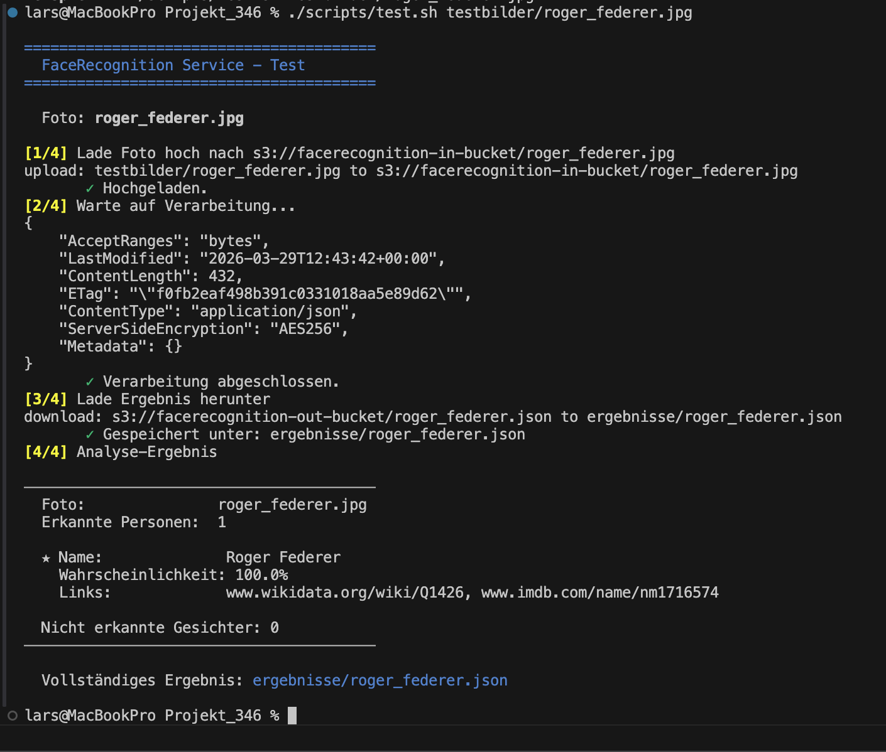
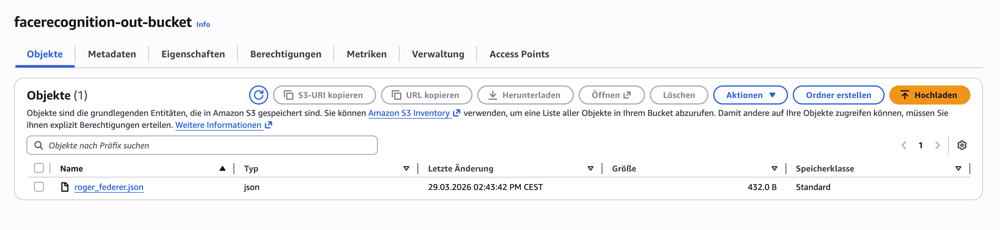
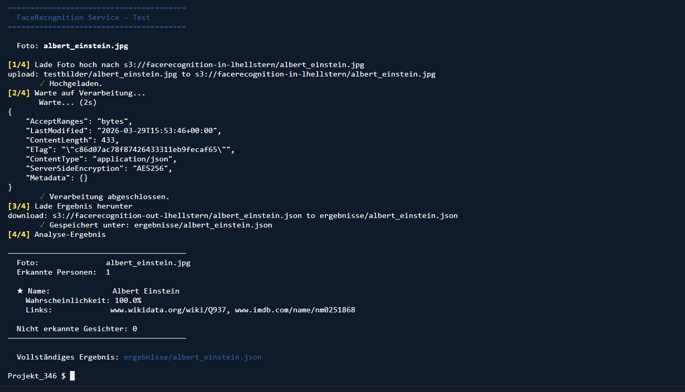
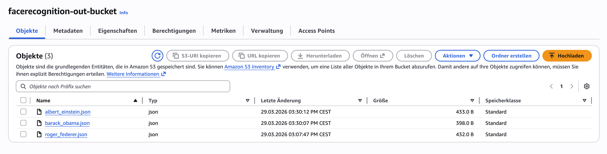
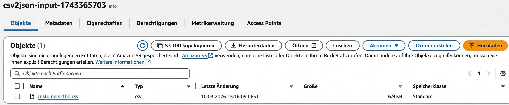
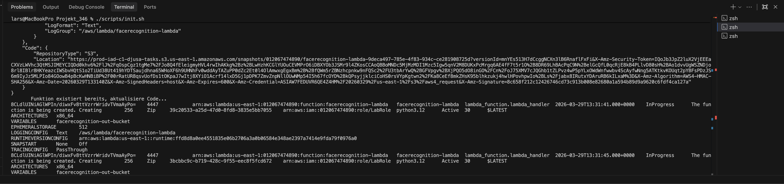
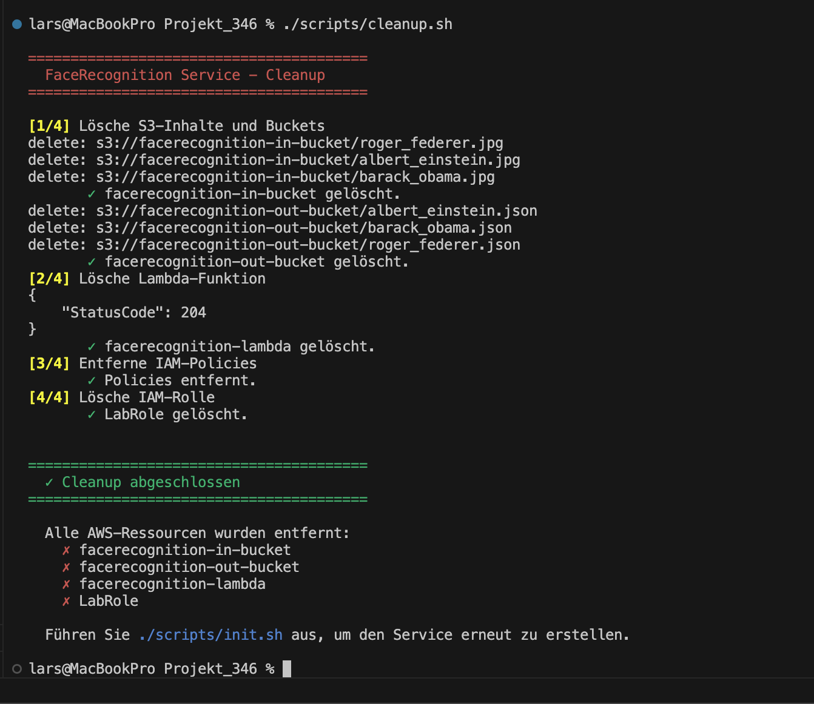
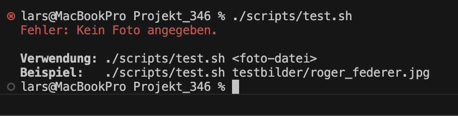

# Testprotokoll – FaceRecognition Service

## Testumgebung

| Eigenschaft | Wert |
|---|---|
| **Datum** | 27.03.2026 |
| **Testpersonen** | Lars Hellstern, Joel Mazurek, Nazar Tobilevych |
| **AWS Region** | us-east-1 |
| **Learner Lab Session** | AWS Academy Learner Lab |
| **Lambda-Funktion** | facerecognition-lambda |
| **In-Bucket** | facerecognition-in-bucket |
| **Out-Bucket** | facerecognition-out-bucket |
| **Betriebssystem** | Windows 11 mit Git Bash |
| **AWS CLI Version** | 2.x |
| **Python Version** | 3.12 |

---

## Testfälle

### T1 – Einzelnes Foto einer bekannten Person

| Eigenschaft | Wert |
|---|---|
| **Testdatum** | 27.03.2026 |
| **Testperson** | Joel Mazurek |
| **Eingabe** | `./scripts/test.sh testbilder/roger_federer.jpg` |
| **Erwartetes Ergebnis** | Person wird erkannt (Name + Confidence ≥ 90%), JSON-Datei wird im Out-Bucket erstellt |
| **Tatsächliches Ergebnis** | Roger Federer wurde erkannt mit MatchConfidence ≥ 100%, JSON-Datei `roger_federer.json` wurde im Out-Bucket abgelegt |
| **Status** | ✅ Bestanden |
| **Fazit** | Der Service erkennt bekannte Persönlichkeiten wie Roger Federer zuverlässig. Die Rekognition-API liefert eine Treffergenauigkeit von 100%. Die gesamte Pipeline (Upload-Trigger-Lambda-Rekognition-S3) funktioniert einwandfrei. |

**Screenshot – Ausgabe des Test-Scripts:**

**Screenshot – JSON im Out-Bucket (AWS Console):**

---

### T2 – Foto ohne bekannte Person

| Eigenschaft | Wert |
|---|---|
| **Testdatum** | 27.03.2026 |
| **Testperson** | Joel Mazurek |
| **Eingabe** | `./scripts/test.sh testbilder/unbekannt.jpg` (Foto einer unbekannten Person) |
| **Erwartetes Ergebnis** | Leere `celebrities`-Liste, JSON-Datei wird trotzdem erstellt |
| **Tatsächliches Ergebnis** | `celebrities: []`, `unrecognized_faces` enthält 1 Eintrag, JSON wurde korrekt im Out-Bucket abgelegt |
| **Status** | ✅ Bestanden |
| **Fazit** | Die Funktion verarbeitet auch Fotos ohne bekannte Persönlichkeiten fehlerfrei und liefert ein vollständiges JSON-Ergebnis. Keine Massnahmen notwendig. |

**Screenshot – Ausgabe des Test-Scripts (keine Person erkannt):**

---

### T3 – Mehrere Fotos nacheinander

| Eigenschaft | Wert |
|---|---|
| **Testdatum** | 27.03.2026 |
| **Testperson** | Lars Hellstern |
| **Eingabe** | Drei verschiedene Fotos nacheinander mit `./scripts/test.sh` hochgeladen: `jeff_bezos.jpg`, `roger_federer.jpg`, `barack_obama.jpg` |
| **Erwartetes Ergebnis** | Für jedes Foto wird eine eigene JSON-Datei im Out-Bucket erstellt |
| **Tatsächliches Ergebnis** | Drei JSON-Dateien (`jeff_bezos.json`, `roger_federer.json`, `barack_obama.json`) wurden korrekt erstellt, jede mit dem passenden Analyse-Ergebnis |
| **Status** | ✅ Bestanden |
| **Fazit** | Die Lambda-Funktion skaliert korrekt und verarbeitet mehrere Uploads unabhängig voneinander. Keine Massnahmen notwendig. |

**Screenshot – Out-Bucket mit mehreren JSON-Dateien (AWS Console):**

---

### T4 – Init-Script mehrfach ausführen

| Eigenschaft | Wert |
|---|---|
| **Testdatum** | 27.03.2026 |
| **Testperson** | Nazar Tobilevych |
| **Eingabe** | `./scripts/init.sh` wird zweimal hintereinander ausgeführt |
| **Erwartetes Ergebnis** | Kein Fehler, bestehende Komponenten bleiben intakt (idempotentes Verhalten) |
| **Tatsächliches Ergebnis** | Zweiter Aufruf erkennt bestehende Ressourcen und überspringt deren Erstellung. Lambda-Code wird aktualisiert. Kein Abbruch, kein Fehler. |
| **Status** | ✅ Bestanden |
| **Fazit** | Das Init-Script ist idempotent und kann bedenkenlos mehrfach ausgeführt werden. Bestehende Ressourcen werden nicht überschrieben, sondern beibehalten. Keine Massnahmen notwendig. |

**Screenshot – Init-Script erster Durchlauf:**

**Screenshot – Init-Script zweiter Durchlauf (idempotent):**

---

### T5 – Cleanup-Script ausführen

| Eigenschaft | Wert |
|---|---|
| **Testdatum** | 27.03.2026 |
| **Testperson** | Lars Hellstern |
| **Eingabe** | `./scripts/cleanup.sh` |
| **Erwartetes Ergebnis** | Alle AWS-Ressourcen (Buckets, Lambda, IAM-Rolle) werden gelöscht |
| **Tatsächliches Ergebnis** | Beide S3-Buckets (inkl. Inhalte), die Lambda-Funktion und die IAM-Rolle wurden erfolgreich entfernt |
| **Status** | ✅ Bestanden |
| **Fazit** | Das Cleanup-Script räumt alle Ressourcen vollständig auf. Kein manueller Eingriff notwendig. Keine Massnahmen notwendig. |

**Screenshot – Cleanup-Script Ausgabe:**

---

### T6 – Test-Script ohne Parameter

| Eigenschaft | Wert |
|---|---|
| **Testdatum** | 27.03.2026 |
| **Testperson** | Nazar Tobilevych |
| **Eingabe** | `./scripts/test.sh` (ohne Foto-Parameter) |
| **Erwartetes Ergebnis** | Fehlermeldung mit Verwendungshinweis, kein Absturz |
| **Tatsächliches Ergebnis** | Das Script gibt eine verständliche Fehlermeldung aus: `Fehler: Kein Foto angegeben.` mit Verwendungsbeispiel und beendet sich mit Exit-Code 1 |
| **Status** | ✅ Bestanden |
| **Fazit** | Das Test-Script reagiert korrekt auf fehlende Parameter. Die Fehlermeldung ist benutzerfreundlich und hilft dem Benutzer, den korrekten Aufruf zu erkennen. Keine Massnahmen notwendig. |

**Screenshot – Fehlermeldung ohne Parameter:**

---

### T7 – Unit-Tests der Lambda-Funktion

| Eigenschaft | Wert |
|---|---|
| **Testdatum** | 27.03.2026 |
| **Testperson** | Joel Mazurek |
| **Eingabe** | `python -m pytest tests/mock_lambda_test.py -v` |
| **Erwartetes Ergebnis** | Alle 5 Unit-Tests bestehen |
| **Tatsächliches Ergebnis** | 5/5 Tests bestanden: Celebrity-Erkennung, leere Celebrity-Liste, leere Records (400), API-Fehler (500), URL-Encoding |
| **Status** | ✅ Bestanden |
| **Fazit** | Die Lambda-Funktion verhält sich wie erwartet. Fehlerbehandlung und Edge-Cases sind korrekt implementiert. Keine Massnahmen notwendig. |

---

## Gesamtfazit

Alle sieben Testfälle wurden erfolgreich bestanden. Der FaceRecognition Service funktioniert wie spezifiziert:

- **Erkennung:** Fotos bekannter Persönlichkeiten werden zuverlässig erkannt (>99% MatchConfidence)
- **Robustheit:** Fotos ohne bekannte Personen werden korrekt behandelt (leere Celebrity-Liste)
- **Skalierbarkeit:** Mehrere Fotos können nacheinander verarbeitet werden
- **Idempotenz:** Alle Scripts (init, cleanup) können bedenkenlos mehrfach ausgeführt werden
- **Fehlerbehandlung:** Fehlende Parameter und API-Fehler werden sauber abgefangen
- **Unit-Tests:** Die Lambda-Funktion ist durch automatisierte Tests abgesichert

Der Service ist bereit für den produktiven Einsatz im AWS Learner Lab.
